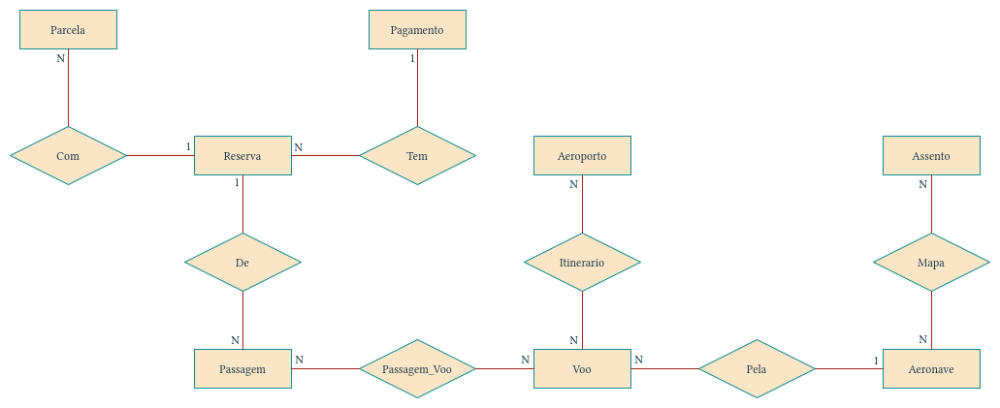
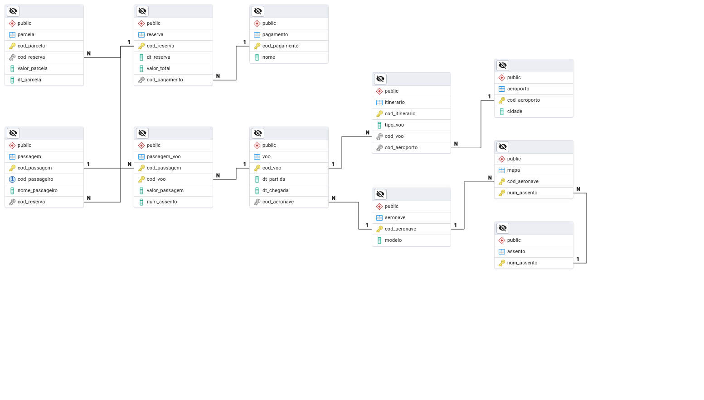

# Banco de dados para Companhia de Linhas Aéreas

Projeto de banco de dados relacional para uma companhia aérea fictícia, implementado em PostgreSQL.

## Estrutura do banco

### Diagrama Entidade-Relacionamento

### Tabelas

## Roadmap

- [x] Criar tabelas
- [x] Criar função para inserts
- [x] Criar função para deletes
- [x] Criar função para alterações
- [x] Estruturar movimentações para consistência de dados (triggers)
- [x] Criar controle de acesso
- [x] Criar relatórios
- [x] Melhorar documentação
